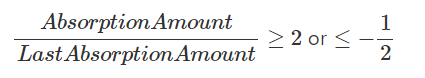
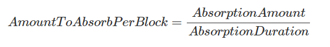
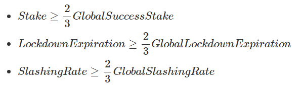
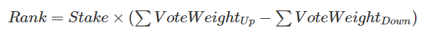
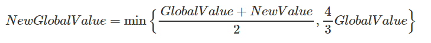
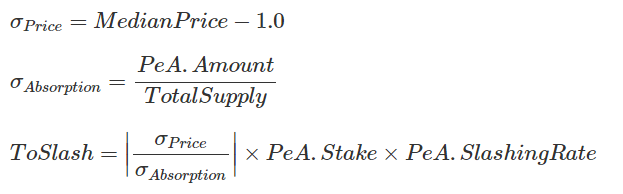

# Stablecoin Protocol

After the CoLoa hardfork, 3 new consensus contracts are deployed:

* [ZUSD](https://explorer.nexty.io/address/0x0000000000000000000000000000000000045678/transactions "ZUSD Smart Contract address") - the stablecoin ERC20 token, initialized with zero supply.
* [gZD](https://explorer.nexty.io/address/0x0000000000000000000000000000000000034567/transactions "ZD Smart Contract address") - the ZRC20 wrapper of ZD. Anyone can deposit ZD to get the token, and withdraw back to ZD anytime. This token is convenient for dapp usage including the Seigniorage DEX. The DEX will only interact with gZD.
* [Seigniorage](https://explorer.nexty.io/address/0x0000000000000000000000000000000000023456/transactions) - the on-chain DEX for gZD/ZUSD pair. Anyone can place limit order to exchange these 2 tokens. In the occasion of supply expansion or contraction, the orders of the appropriate direction will be absorbed by the consensus, in other words, consensus will execute an market order and filled as much order as necessary.

## Consensus

### Price Feed

* *PriceSamplingInterval* = 300 blocks (10 mins)
* *PriceSamplingDuration* = 302400 blocks (7 days)

ZUSD/USD price can be fed to the consensus by the sealer/miner, every *PriceSamplingInterval* of block (~10 mins). Sealer can choose to feed the price or not. The median price is calculate by the median value of the last *PriceSamplingDuration* blocks, (maximum 1008 values). The median price is only calculated when there’s a super majority of sealers feed their prices. (That is 2/3 of 1008 = 672)

### Exchange

DEX is an onchain decentralized exchange for gZD/ZUSD pair, built for converting between the two tokens. The limit orders placed there can be filled by other user order, or will be filled by the system absorptions.

The order ID is calculated as bellow:

    OrderID = sha256(maker + index)

Where:

* *maker* is the address of the order maker
* *index* is the order index provided by the order maker

This allows user to manage their own off-chain order list, much like an HDWallet does.

### Execution

In initialization phase of the block, before any user tx is included, the DEX.OnBlockInitilized() is executed by the consensus, generating the first tx and receipt in the block. This execution does:

* clear out any expired or finished absorption.
* unlock any finished preemptive lockdown.
* perform the market order to absorb the user limit order on the DEX.
* check the condition to trigger new preemptive absorption.

For every price block, the median price up to that block is passed to the ``DEX.OnBlockInitilized(MedianPrice)``, and the following additional actions are taken care by the execution:

* check any of the new condition to trigger new active/passion absorption.
* check any slashing condition to slash the preemptive initiator.

## Absorption Mechanism

No ZUSD is mint out of thin air, nor to anyone will. ZUSD must be exchanged with NTY by the market demand itself.
There are 3 conditions for an absorption to be triggered.

1. [Passive](https://docs.ezdefi.com/studio/technical-paper/edit#passive-absorption)
2. [Active](https://docs.ezdefi.com/studio/technical-paper/edit#active-absorption)
3. [Preemptive](https://docs.ezdefi.com/studio/technical-paper/edit#preemptive-absorption-pea)

### Passive Absorption

Passive absorption is triggered when there is no absorption for a week. This is the most defensive supply absorption mechanism to make sure the supply will continuously adjust to even the smallest change of demand, when the network is mature and well adopted.

For Passive and Active conditions, ZUSD supply change is always calculated by the fed Median Price.

***AbsorptionAmount = TargetSupply - Supply***

***AbsorptionAmount = Supply x (MedianPrice - 1.0)***

### Active Absorption

Active absorption is triggered when the price level is disruptively changed in an exponential ways, to quickly adjust to a new demand waves. An active absorption is triggered when.

When the price keeps going in the same direction (up or down), the next supply Change must be at least two times as large as the last one. This condition allows the network quickly adjust to the sudden change of market demand, but still makes it exponentially expensive for adversaries to manipulate the price of ZUSD.

When the price is changing in one direction (from up to down, or vice versa), the next supply change must be at least half as large as the last one, in opposite direction. This change of direction allow the network to wind down the absorption in a stabilizing market.

### Absorption Process

For each block during the absorption, a market order is filled for the consensus with the amount of:

If there’s not enough limit order to fill, no more token supply is changed. Additional order can be placed during the absorption time.

The absorption will end after either:

* the target supply is reached, or
* the absorption time pass **AbsorptionDuration**

In the mainnet:

``
AbsorptionExpiration = 1 week
AbsorptionDuration = half a week
``

### Preemptive Absorption (PeA)

This is the most complicated mechanism of absorption, but provide the necessary flexibility to adjust the supply without waiting for a price to be deviated too far from an anchoring value. Anyone can initialize a preemptive absorption with a stake and a price. PeA requires an voting auction before and Lockdown after the absorption.

#### Proposal Auction

The Auction for Initiator starts when the first intiator submits her proposal on chain. NTY holders will vote for them as soon as the proposal is submitted. Each vote can have the following values:

* Maker: address of the initiator.
* Amount: the amount of ZUSD it wishes to change.
* Stake: the amount of gZD to lock for slashing.
* SlashingRate: (optional) slashing rate.
* LockdownExpiration: (optinal) lockdown time (in block) for the Stake.

If SlashingRate and LockdownExpiration is not provided, the global version of the params is used.

Proposal Requirements:

#### Voting and Ranking

Anyone with NTY and/or gZD can vote for or against a proposal. The weight of each vote is the total of NTY and gZD, and only calculate at the ranking time. An address votes for a proposal, then transfer all NTY and gZD out after that will have zero weight after that.

A rank of the a proposal is calculate as below:

#### Activation

* No other PeA or Lockdown is in active. (The other 2 absorptions are allowed)
* There’s atleast one Proposal satifies both of the following conditions:
  * has proposed for atleast *GlobalLockdownExpiration/4*,
  * has *Rank ≥ 2/3 GlobalSuccessRank* and *Rank > 0*

When the active condition is reached, the proposal with the highest Rank win the auction, and active a new Pre-emptive Absorption.

#### Adaptive Requirements

The following global params are adapting to each winning proposal and preemptive absorption:
* Proposal’s Stake
* Proposal’s SlashingRate
* Proposal’s LockdownExpiration
* Pre-emptive Absoprtion winning Rank

The adapting formula:

#### PeA Absorption

After the Voting Auction success, a new Pre-emptive Absorption is triggered with (Amount, LockdownExpiration, SlashingRate).

1. The absorption process is almost exactly the same with Active and Passive Absorption, except only half of the amount for each block is filled with orders from the exchange, the other half is preserved for side absorption
2. PeA is treated exactly as Active and Passive Absorption: will override any on-going AA/PA, and will be overriden by new AA/PA if their condition is met.
3. A Lockdown is started independently with the absorption process. Lockdown prohibits new PeA, but does not prohibit new AA/PA. Lockdown is not canceled/aborted when by new AA/PA.

**Side Absorption**

For each limit order absorbed by a PeA, an identical limit order is filled for the PeA maker with her token allowance for the DEX. If the allowance and balance are not sufficient, the side absorption will simply be ignored.

The PeA absorption will continues until the target supply is reached, even when no side-absorption occur.

#### The Lockdown

During the lockdown, whenever the median price deviation goes in the opposite direction of the PeA:

* the absorption will be temporarily halted
* the maker will be slashed

The absorption will be resumed when the new median price goes in the same direction again.

The slashing gZD amount is calculated as bellow:

The actual amount to be slashed must be positive and no more than the remaining stake.

***Slashed = min{ToSlash,RemainingStake}***

If all the lockdown stake is slashed, the PeA will be prematurely stopped. Otherwise, the remaining stake will be refunded when the LockdownExpiration over.

#### Conclusion

Preemptive Absorption initiators are market makers, “bank” reserves, OTC dealers which are in control of large flows of money (ZUSD). Not sitting outside of the system nor being centralized in anyway, they profit themselves by reserving and trading large amount of money (ZUSD) while providing a high level of liquidity and stability to the network. As part of the decentralized system, anyone can be the Initiator, but without a large amount of fund, everyone can still be traders. NTY holders, initiators and traders together form a decentralized circle of stabilization, where each and everyone can profit themselves while provide the liquidity of ZUSD as a service to the user of the network.